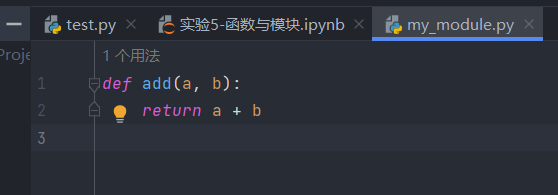
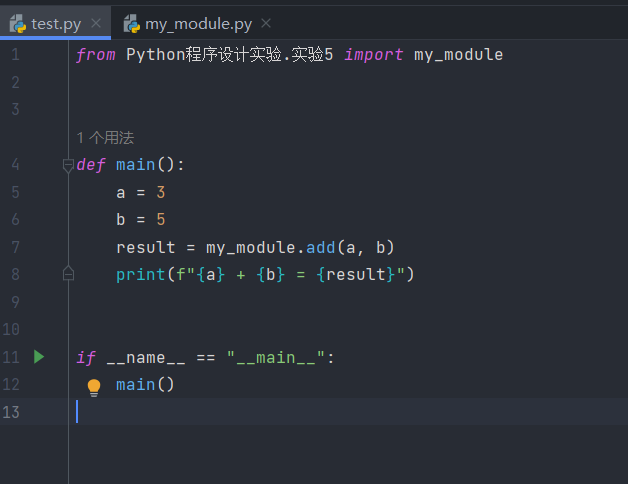
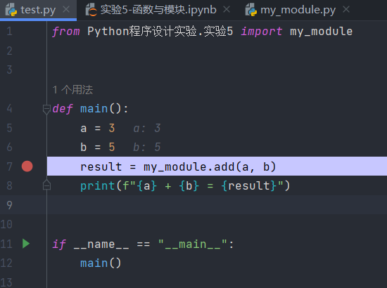
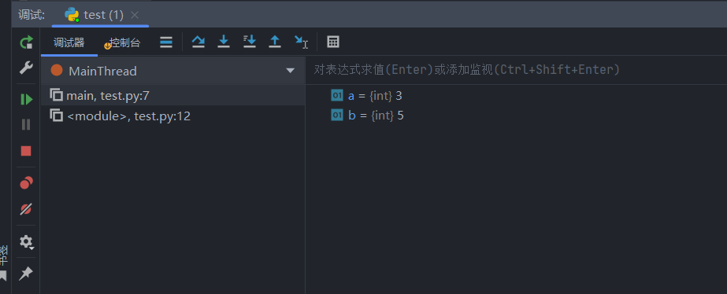

## <center>实验五 函数与模块</center>

姓名：马星 学号：5418122020 班级：计算机科学与技术(卓越工程师计划)221班

### 一、实验目的
1. 了解函数的基本概念，掌握函数的声明和调用方法和python内置函数的使用。
2. 了解变量的作用域，掌握局部变量和全局变量的使用。
3. 了解递归函数、匿名函数的概念和使用。
4. 了解模块化的程序设计方法，学习通过调试窗口查看变量的值。

### 二、实验内容
1. 练习Python函数的声明和调用，学习python内置函数的使用。
2. 练习Python模块化的程序设计与调试的方法，在调试窗口中查看变量的值。
3. 利用匿名函数和递归函数进行程序。
4. 完成教材139页的课后练习第4、5题。


### 三 实验步骤

1. 练习Python函数的声明和调用，学习python内置函数的使用。  


```python
# 声明函数
def add(a: int, b: int) -> int:
    return a + b


def outer():  # 函数支持嵌套
    def inner():
        pass


def method(*args, **kwargs):  # 可变参数列表
    pass


# 调用函数
add(1, 2)
# 内置函数使用
lst = ["ACCEPT", "Wrong Answer", "Time Limit Error", "RunTime Error", "Compile Error", "Unknown Error"]
sorted(lst, key=lambda x: len(x))  # 排序函数, 按长度排序
print(max(lst))  # max:最大值函数; print:打印函数
a, b = divmod(10, 3)  # divmod(x,y): return x//y, x%y
# ...

```

2. 练习Python模块化的程序设计与调试的方法，在调试窗口中查看变量的值。


(1) 模块化的程序设计:

首先编写模块



再导入模块进行使用




(2) 调试窗口查看变量值:

首先给程序在合适位置打上断点, 然后运行, 程序将会停在断点处



此时打开调试窗口, 里面可以看到变量的值




3. 利用匿名函数和递归函数进行程序。


```python
# 匿名函数
square = lambda x: x ** 2  # x的平方
print(square(5))  #输出25

is_even = lambda x: x % 2 == 0  # 判断x是否为偶数
print(is_even(6))  # 输出：True


# 递归函数1 - 不使用加法、减法、位运算实现a+b
def add(a, b):
    def oneDigitAdd(a: int, b: int) -> int:
        """一位十进制数相加"""
        map = [
            [0, 1, 2, 3, 4, 5, 6, 7, 8, 9],
            [1, 2, 3, 4, 5, 6, 7, 8, 9, 10],
            [2, 3, 4, 5, 6, 7, 8, 9, 10, 11],
            [3, 4, 5, 6, 7, 8, 9, 10, 11, 12],
            [4, 5, 6, 7, 8, 9, 10, 11, 12, 13],
            [5, 6, 7, 8, 9, 10, 11, 12, 13, 14],
            [6, 7, 8, 9, 10, 11, 12, 13, 14, 15],
            [7, 8, 9, 10, 11, 12, 13, 14, 15, 16],
            [8, 9, 10, 11, 12, 13, 14, 15, 16, 17],
            [9, 10, 11, 12, 13, 14, 15, 16, 17, 18]
        ]
        return map[a][b]

    a, b = str(a), str(b)
    res = []

    def f(i: int, carry: int) -> None:
        """递归函数, 计算a+b, 当前是第i位, 低位进位为carry"""
        if i > len(a) and i > len(b):  # 递归出口: a和b每一位都加完了
            if carry != 0:
                res.append(str(carry))
            return
        # a和b对应位相加
        if i <= len(a) and i <= len(b):
            add = oneDigitAdd(int(a[-i]), int(b[-i]))
        elif i <= len(a):
            add = int(a[-1])
        else:
            add = int(b[-1])
        high, low = add // 10, add % 10  # 进位和本位
        low = oneDigitAdd(low, carry)  # 本位再和低位进位相加,
        if high == 0:
            # 进位为1 -> 本位+低位进位不可能再进位, carry最大为1
            # 进位为0 -> 本位+低位进位可能发生进位
            high, low = low // 10, low % 10
        res.append(str(low))
        f(i + 1, high)  # 递归计算下一位

    f(1, 0) # 递归计算

    return "".join(res[::-1])# 倒序拼接


a, b = map(int, input("请输入加数a和b: ").split())
print(f"{a} + {b} = {add(a, b)}")


#  递归函数2 - 约瑟夫问题递归解法
def josephus(n: int, m: int):
    """
    f(N,M): N个人站成环形,编号从0开始,从0号开始每m个人出局,最后剩余的人编号为多少
    第M个人出局 -> 剩余N-1个人 -> 在大小为N-1的问题中解的编号偏移为M
    f(N,M) = (f(N−1,M) + M) % N
    """
    if n == 1: return 0
    return (josephus(n - 1, m) + m) % n


n, m = map(int, input("请输入人数n和出局数字m: ").split())
print("最后剩余的人编号(从0开始)为: ", josephus(n, m))

```

    25
    True
    

    请输入加数a和b:  123 589
    

    123 + 589 = 712
    

    请输入人数n和出局数字m:  5 3
    

    最后剩余的人编号(从0开始)为:  3
    


5. 完成教材139页的课后练习第4题。
编写函数avg(lst),参数lst是一个列表. 函数可以返回lst的整数平均值return int(sum(lst)/len(lst)),调用avg(lst)函数求每个学生的平均成绩
已知成绩列表s={'小李':[77,54],'小张':[89,66,78,99],'小陈':[90],'小杨':[69,58,93]}


```python
def avg(lst: list[int]) -> int:
    return int(sum(lst) / len(lst))


s = {'小李': [77, 54], '小张': [89, 66, 78, 99], '小陈': [90], '小杨': [69, 58, 93]}
ans = {}
for name, scores in s.items():
    ans[name] = avg(scores)
print("每个学生的平均成绩: ",ans)
```

    每个学生的平均成绩:  {'小李': 65, '小张': 83, '小陈': 90, '小杨': 73}
    

5. 完成教材139页的课后练习第5题。
现有一个字典存放着学生的学号和成绩. 成绩列表里的3个数据分别是学生的语文,数学和英语成绩:
dict={'01':[67,88,45],'02':[97,68,85],'03':[97,98,95],'04':[67,48,45],'05':[82,58,75],'06':[96,49,65]}
完成以下操作:
(1) 编写函数,返回每门成绩均大于85的学生的学号
(2) 编写函数,返回每一个学号对应的平均分和总分,结果保留2位小数
(3) 编写函数,返回按总分升序排列的学号列表


```python
def getID(dic: dict[str:list[int]], minScore: int) -> list[str]:
    ans = []
    for id, scores in dic.items():
        if min(scores) > minScore:
            ans.append(id)
    return ans


def getAvgAndSum(dic: dict[str:list[int]]) -> list[tuple[float, int]]:
    def avg(lst: list[int]) -> float:
        return round(sum(lst) / len(lst), 2)

    ans = []
    for scores in dic.values():
        ans.append((avg(scores), sum(scores)))
    return ans


def getIDOrderBySum(dic: dict[str:list[int]]) -> list[str]:
    ans = []
    for id, scores in dic.items():
        ans.append((id, sum(scores)))
    ans.sort(key=lambda o: o[1])
    ans = [o[0] for o in ans]
    return ans


dic = {'01': [67, 88, 45], '02': [97, 68, 85], '03': [97, 98, 95], '04': [67, 48, 45], '05': [82, 58, 75],
       '06': [96, 49, 65]}
print(f"成绩均大于85的学生学号有: {getID(dic, 85)}")
print(f"每一个学生的平均分和总分: {getAvgAndSum(dic)}")
print(f"按总分升序排序的学号为: {getIDOrderBySum(dic)}")

```

    成绩均大于85的学生学号有: ['03']
    每一个学生的平均分和总分: [(66.67, 200), (83.33, 250), (96.67, 290), (53.33, 160), (71.67, 215), (70.0, 210)]
    按总分升序排序的学号为: ['04', '01', '06', '05', '02', '03']
    

### 四 实验总结

 
本次实验的目的是了解函数的基本概念，掌握函数的声明和调用方法，以及Python内置函数的使用。
同时，我们还需要了解变量的作用域，掌握局部变量和全局变量的使用。
此外，我们还学习了递归函数、匿名函数的概念和使用，以及模块化的程序设计方法。

在实验内容方面，我们首先练习了Python函数的声明和调用，并学习了Python内置函数的使用。
通过这些练习，我们对函数有了更深入的理解，并能够熟练地使用它们。

接下来，我们进行了Python模块化的程序设计与调试的练习，并在调试窗口中查看了变量的值。
这一部分的学习使我们更加熟悉了模块化的程序设计方法，并掌握了如何通过调试窗口查看变量的值。

在实验的后半部分，我们利用匿名函数和递归函数进行了程序设计。
通过这些练习，我们对匿名函数和递归函数有了更深入的理解，并能够灵活地使用它们。

最后，我们完成了教材139页的课后练习第4、5题。
这两个题目涉及到了函数的声明和调用，以及模块化的程序设计方法。
通过完成这两个题目，我们对本次实验的内容有了更全面的掌握。

总的来说，本次实验对于理解函数的概念、掌握函数的声明和调用方法，以及学习Python内置函数的使用非常有帮助。
同时，我们也对变量的作用域、局部变量和全局变量的使用有了更深入的了解
。此外，我们还学习了递归函数、匿名函数的概念和使用，以及模块化的程序设计方法，这对我们今后的编程学习将有很大的帮助。
 
