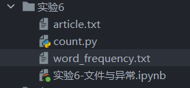
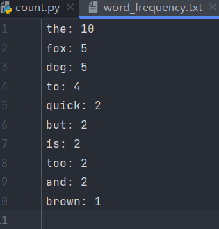

## <center>实验六 文件与异常</center>

姓名：马星 学号：5418122020 班级：计算机科学与技术(卓越工程师计划)221班

### 一、实验目的
1. 了解文件的基本概念，掌握文件的打开、关闭与读写等基本操作方法。
2. 了解异常的概念，掌握常见的异常类型及其处理方法。
3. 掌握文件与异常的基本应用。


### 二、实验内容
1. 下载一篇txt文件格式英文短文，编写程序统计该文本中出现频率排名前10的单词并生成一个词频文件。
2. 完成教材157页的课后练习第1题。


### 三 实验步骤

1. 下载一篇txt文件格式英文短文，编写程序统计该文本中出现频率排名前10的单词并生成一个词频文件。


```python
import re
from collections import Counter

# 读取文本文件
with open("article.txt", "r") as file:
    text = file.read()

# 使用正则表达式提取单词
words = re.findall(r'\b\w+\b', text.lower())

# 计算单词出现的频率
word_count = Counter(words)

# 获取出现频率排名前10的单词
top_10_words = word_count.most_common(10)
print(top_10_words)

# 将结果写入词频文件
with open("word_frequency.txt", "w") as file:
    for word, count in top_10_words:
        file.write(f"{word}: {count}\n")

```

    [('the', 10), ('fox', 5), ('dog', 5), ('to', 4), ('quick', 2), ('but', 2), ('is', 2), ('too', 2), ('and', 2), ('brown', 1)]
    

article文本:The quick brown fox jumps over the lazy dog. The dog barks at the fox, but the fox is too quick for the dog to catch. The dog then decides to chase the fox, but the fox is too clever and manages to escape. The dog finally gives up and goes back to sleep.
运行后生成word_frequency文件




2. 完成教材157页的课后练习第1题。
请根据第5章课后习题(1)中最后生成的通信录字典创建"通信录.csv"文件,然后编写程序查询大王的手机号,QQ号和微信号


```python
import csv

# 将字典数据写入"通讯录.csv"文件
dic = {'小新': {'手机': 1391300001, 'QQ': 18191220001, '微信': 'xx9907'}, '小亮': {'手机': 1391300002, 'QQ': 18191220002, '微信': 1391300002}, '小刚': {'手机': 1391300003, 'QQ': 18191220003, '微信': 'gang1004'}, '大刘': {'手机': 1391400001, 'QQ': 18191230001, '微信': 'liu666'}, '大王': {'手机': 13914000004, 'QQ': 18191230002, '微信': 'jack_w'}, '大张': {'手机': 1391400003, 'QQ': 18191230003, '微信': 1391400003}}

with open("通讯录.csv", "w", newline="", encoding="utf-8") as csvfile:
    fieldnames = ["姓名", "手机", "QQ", "微信"]
    writer = csv.DictWriter(csvfile, fieldnames=fieldnames)
    writer.writeheader()
    for name, info in dic.items():
        writer.writerow({"姓名": name, "手机": info["手机"], "QQ": info["QQ"], "微信": info["微信"]})

# 读取"通讯录.csv"文件
def read_csv(file_name):
    with open(file_name, "r", newline="", encoding="utf-8") as csvfile:
        reader = csv.DictReader(csvfile)
        return [row for row in reader]

# 查询"大王"的手机号、QQ号和微信号
def query_info(file_name, name):
    data = read_csv(file_name)
    for row in data:
        if row["姓名"] == name:
            return row["手机"], row["QQ"], row["微信"]
    return None, None, None

# 输出结果
phone, qq, wechat = query_info("通讯录.csv", "大王")
print(f"大王的手机号是：{phone}，QQ号是：{qq}，微信号是：{wechat}")
```

    大王的手机号是：13914000004，QQ号是：18191230002，微信号是：jack_w
    

### 四 实验总结

本次实验的目的是了解文件的基本概念，掌握文件的打开、关闭与读写等基本操作方法。
同时，实验还涉及了异常的概念，要求我们掌握常见的异常类型及其处理方法，并能够将文件与异常的基本应用结合起来。

在实验中，我们首先学习了文件的基本概念，了解了文件是一种用于存储数据的载体。
然后，我们学习了如何打开和关闭文件，以及如何进行文件的读写操作。通过实验中的示例代码，我们掌握了使用Python内置的文件操作函数来打开、读取、写入和关闭文件的方法。

接下来，我们学习了异常的概念，了解了异常是在程序运行过程中发生的错误或异常情况。
实验中介绍了常见的异常类型，例如文件不存在异常（FileNotFoundError）、文件已关闭异常（ValueError）等。
我们还学习了如何使用try-except语句来捕获和处理异常，以保证程序在出现异常时能够正常运行或给出相应的错误提示。

最后，我们将文件操作和异常处理结合起来进行了实践。通过编写代码，我们实现了一个简单的文本文件复制功能。
在这个过程中，我们使用了文件操作的方法来打开源文件和目标文件，并逐行读取源文件内容并将其写入到目标文件中。
同时，我们使用了try-except语句来捕获可能出现的异常情况，例如文件不存在、文件无法打开等，并给出了相应的错误提示。

通过本次实验，我们对文件的基本概念和操作方法有了更深入的了解，掌握了常见的异常类型及其处理方法，并能够将文件与异常的应用结合在实际编程中。这些知识和技能对于我们今后的编程实践将会非常有帮助。
