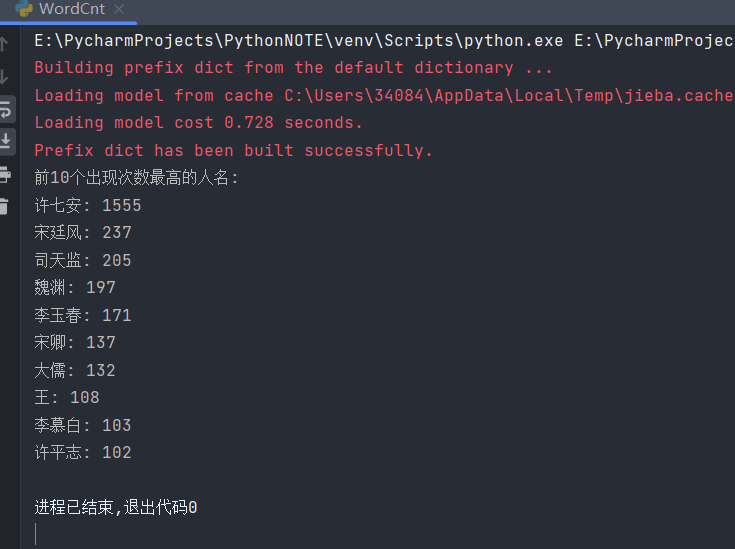
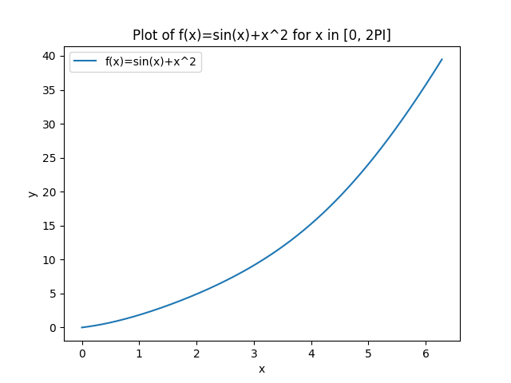
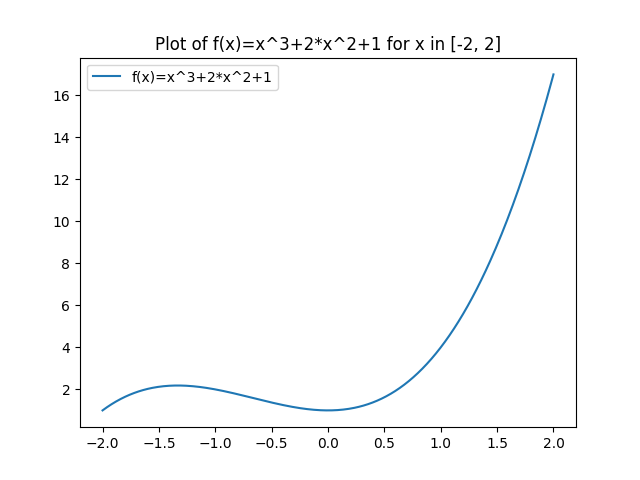

## <center>实验七 Python综合应用</center>

姓名：马星 学号：5418122020 班级：计算机科学与技术(卓越工程师计划)221班

### 一、实验目的
1. 了解Python在文本分析、科学计算和数据分析等方面得具体应用。
2. 掌握Python应用程序得的编写方法。


### 二、实验内容
1. 下载一篇格式为文本文件的中文小说，制作高频词云并统计出场次数最多的10个人物。
2. 完成教材216页的课后练习第1、2题。


### 三 实验步骤

1. 下载一篇格式为文本文件的中文小说，制作高频词云并统计出场次数最多的10个人物。


```python
from jieba import posseg
from collections import Counter
from wordcloud import WordCloud
import matplotlib.pyplot as plt


def countName(words):
    # 筛选出人名
    names = [word for word, flag in words if flag == 'nr']
    name_count = Counter(names)
    # 输出前10个出现次数最高的人名
    print("前10个出现次数最高的人名:")
    for name, count in name_count.most_common(10):
        print(f"{name}: {count}")


def wordCloud(words):
    # 统计所有词的出现次数
    all_words = [word for word, flag in words]
    word_count = Counter(all_words)
    word_count.pop('\n')
    # 创建WordCloud对象
    wordcloud = WordCloud(width=800, height=400, background_color='white', max_words=100, font_path='simhei.ttf',
                          prefer_horizontal=0.9, min_font_size=10, max_font_size=100)
    # 根据Counter对象生成词云
    wordcloud.generate_from_frequencies(word_count)
    # 设置词云参数
    wordcloud.to_file('wordcloud.png')
    # 展示词云图
    plt.imshow(wordcloud)
    plt.axis('off')
    plt.show()


# 读取文本文件
with open("大奉打更人.txt", "r", encoding="utf-8") as f:
    text = f.read()

# 使用jieba库对文本进行分词
words = posseg.cut(text)
words = [(word, flag) for word, flag in words if flag is not None]
countName(words)
wordCloud(words)

```

输出:

生成的词云:


2. 完成教材216页的课后练习第1题。
利用numpy库中的多项式处理函数,计算函数f(x)=x**5+2*x**3+1,当x=2和x=5时的值,并输出f(x)的一阶导数和二阶导数


```python
import numpy as np

# 创建多项式对象
coefficients = [1, 0, 2, 0, 1]  # 对应于 x**5 + 2*x**3 + 1
p = np.poly1d(coefficients)

# 计算一阶导数和二阶导数
p_derivative_1 = p.deriv()
p_derivative_2 = p_derivative_1.deriv()

# 计算x=2和x=5时的值
value_at_2 = p(2)
value_at_5 = p(5)

print("f(2) =", value_at_2)
print("f(5) =", value_at_5)
print("f(x)的一阶导数为:\n", p_derivative_1)
print("f(x)的二阶导数为:\n", p_derivative_2)

```

    f(2) = 25
    f(5) = 676
    f(x)的一阶导数为:
        3
    4 x + 4 x
    f(x)的二阶导数为:
         2
    12 x + 4


3. 完成教材216页的课后练习第2题。
绘制以下函数的图像:
(1) f(x)=sin(x)+x**2, [0,2PI]
(2) f(x)=x**3+2*x**2+1,[-2,2]


```python
import numpy as np
import matplotlib.pyplot as plt


def fun1():
    # (1) f(x)=sin(x)+x**2, [0,2PI]
    x = np.linspace(0, 2 * np.pi, 400)  # 生成[0, 2PI]区间内的400个x值
    y = np.sin(x) + x ** 2  # 计算对应的y值
    plt.figure()  # 创建一个新的图像
    plt.plot(x, y, label='f(x)=sin(x)+x^2')  # 绘制第一个函数的图像
    plt.title('Plot of f(x)=sin(x)+x^2 for x in [0, 2PI]')  # 设置图像标题
    plt.xlabel('x')  # 设置x轴标签
    plt.ylabel('y')  # 设置y轴标签
    plt.legend()  # 显示图例
    plt.savefig("fun1.png")
    plt.show()  # 显示图像


def fun2():
    # (2) f(x)=x**3+2*x**2+1,[-2,2]
    x = np.linspace(-2, 2, 400)  # 生成[-2, 2]区间内的400个x值
    y = x ** 3 + 2 * x ** 2 + 1  # 计算对应的y值
    plt.plot(x, y, label='f(x)=x^3+2*x^2+1')  # 在同一张图像上绘制第二个函数的图像
    plt.title('Plot of f(x)=x^3+2*x^2+1 for x in [-2, 2]')  # 更新图像标题
    plt.legend()  # 更新图例
    plt.savefig("fun2.png")
    plt.show()  # 显示图像

fun1()
# fun2()


```




### 四 实验总结

本次实验主要涵盖了 Python 在不同领域的应用。

在文本分析方面，成功下载中文小说文本文件，制作出了高频词云并统计出了出场次数最多的 10 个人物，这让我们直观地看到了小说中重要的词汇和人物。

在科学计算和数据分析中，利用 numpy 库的多项式处理函数，计算了特定函数在不同 x 值下的值，并输出了一阶导数和二阶导数，加深了对函数计算和导数概念的理解。

最后，通过绘制不同函数的图像，如正弦函数与二次函数的组合以及三次函数与二次函数的组合，进一步掌握了利用 Python 绘制函数图像的方法。

总的来说，本次实验让我们更深入地了解了 Python 在多个方面的强大功能和具体应用，提升了我们的编程能力和对相关知识的掌握程度。
