## <center>实验一 建立Python开发环境</center>

姓名：马星                      学号：5418122020                班级：计算机科学与技术(卓越工程师计划)221班

### 一、实验目的
1. 掌握Python解释器和Anaconda开发包的安装和使用方法；
2. 掌握Jupyter Lab和PyCharm的安装和使用方法；
3. 了解Python语言的基本特点以及Python的交互式和脚本式编程方法。

### 二、实验内容
1. 下载和安装Anaconda虚拟环境和Python解释器。
2. 下载和安装Jupyter Lab和PyCharm开发工具。
3. 基于Python SDK自带命令行工具和IDLE体验Python的交互式和脚本式编程。
4. 基于Jupyter Lab和PyCharm体验Python的交互式和脚本式编程。

### 三、实验步骤

1. 下载和安装Python SDK和Anaconda开发包。

(1) 安装Python SDK: 首先打开python官网 https://www.python.org/ , 点击Download, 根据电脑操作系统选择对应版本的 Python SDK, 我的操作系统为Windows,目前最新版Python SDK 为 3.12, 所以点击下载3.12版本的Windows installer安装包, 并等待下载完成后运行安装程序.

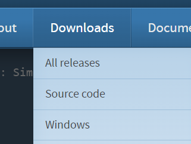

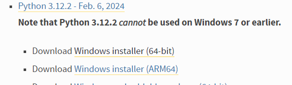

运行安装程序python-3.12.2-amd64.exe, 跟随安装指南进行安装

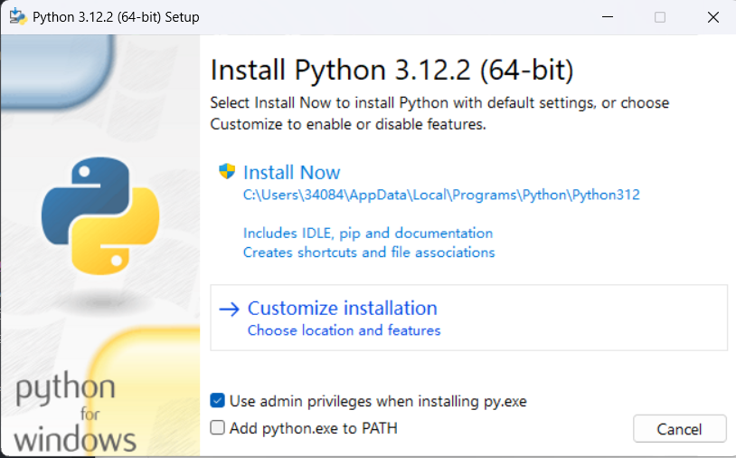

选择Customize installtion

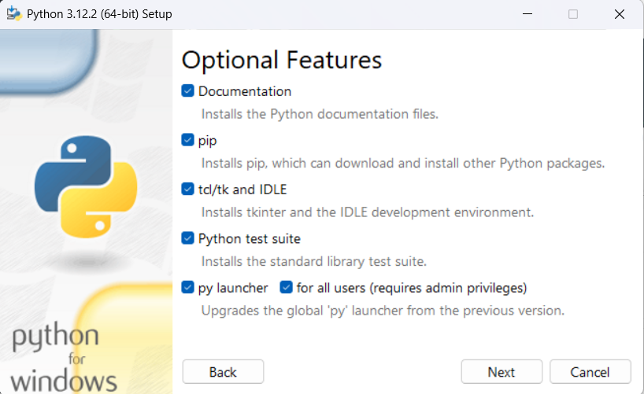

点击next

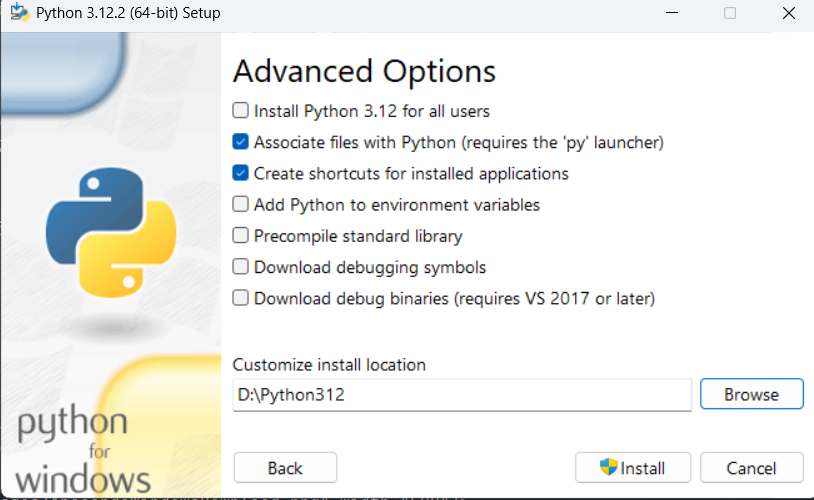

点击install并等待安装,在弹出Success窗口后点击close关闭安装程序即可

(2) 安装Anaconda开发包: 打开Anaconda中文网 https://anaconda.org.cn/ ,网站中有详细的下载安装教程, 同样根据电脑操作系统版本选择对应的Anaconda开发包,我的操作系统为Windows, 所以点击 安装 - 在Windows上安装- 下载 Anaconda 安装程序, 网站跳转后点击Download按钮, 等待下载完成后运行安装程序.

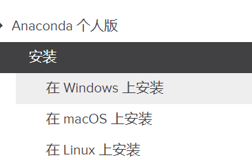


运行安装程序Anaconda3-2023.09-.-Windows-x86_64.exe, 跟随安装指南进行安装

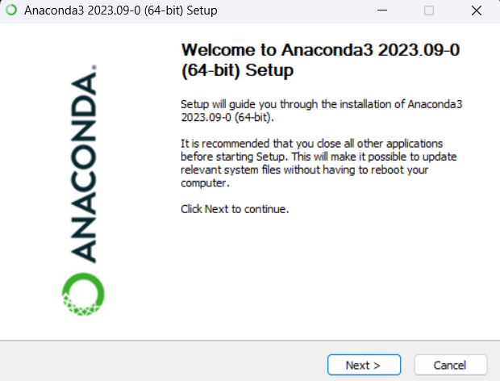

点击next

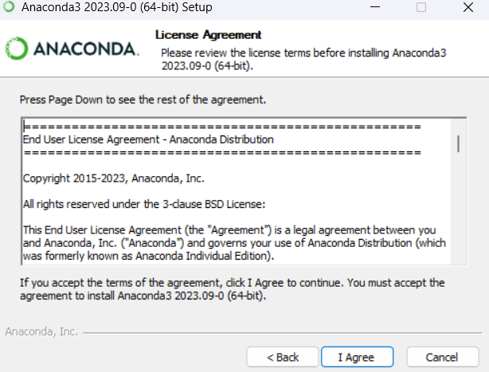

点击I Agree

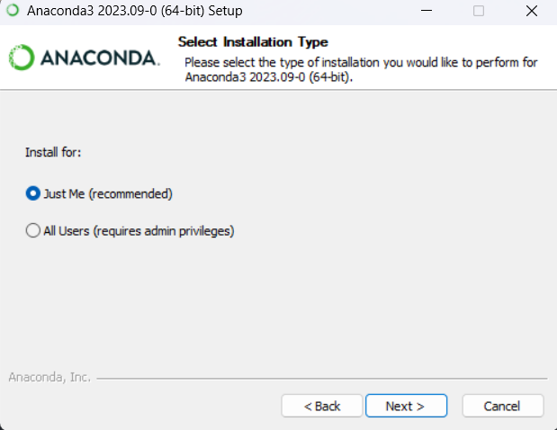

点击next

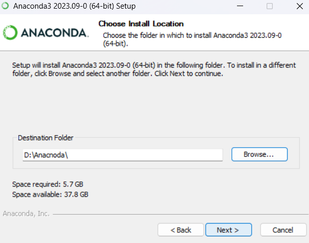

点击next

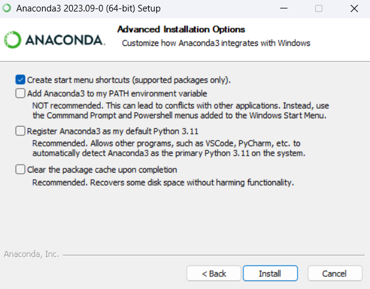

点击install后等待安装即可


2. 下载和安装Jupyter Lab和PyCharm开发工具。

(1) 安装Jupyter Lab: 按键盘上的win+R键打开运行窗口,然后输入cmd打开命令行窗口,在命令行窗口中输入pip install jupyterlab,随后等待安装即可

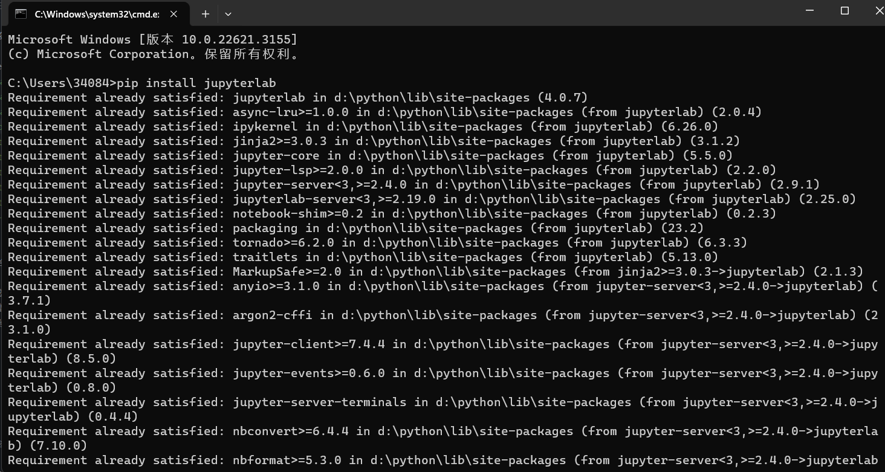

(2) 下载PyCharm开发工具: 进入jetbrains公司的PyCharm下载官网 https://www.jetbrains.com/pycharm/download/ , 找到社区版,点击Download进行安装

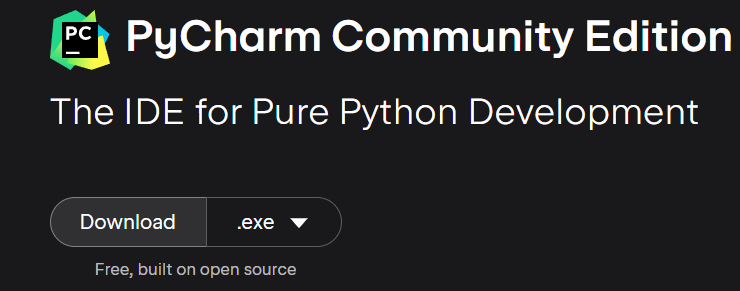

运行安装程序pycharm-community-2023.3.4.exe,跟着安装指南进行按照即可

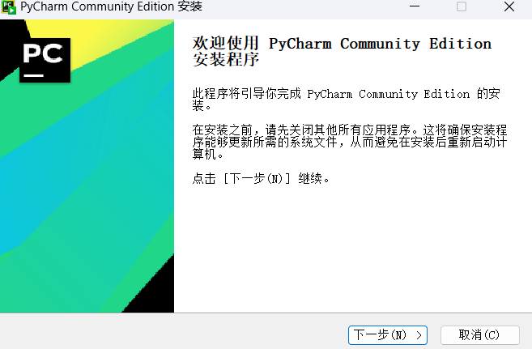

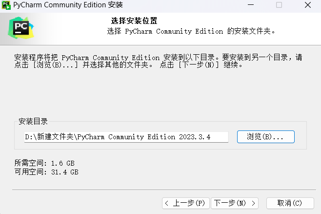

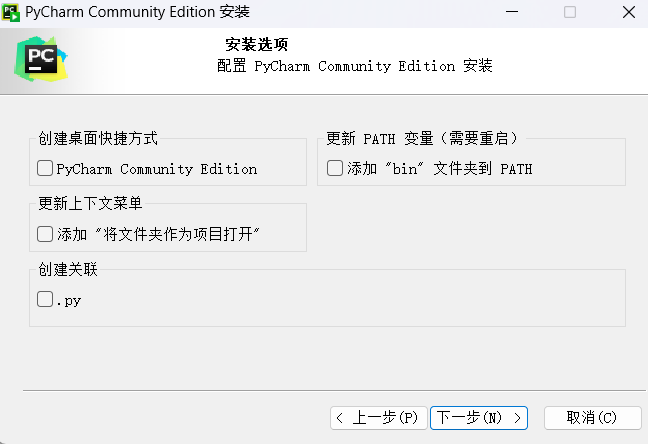

3. 基于Python SDK自带命令行工具和IDLE体验Python的交互式和脚本式编程。

(1)交互式编程: 打开cmd,输入python后可以进入python交互式编程环境, 然后就可以输入和运行python代码

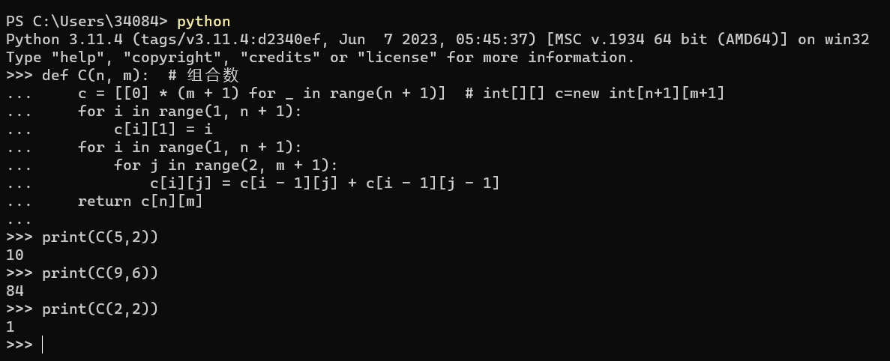

python是一门解释型语言,在交互式模式下,每输入一行语句(一个代码块)就执行一次,如上图定义了一个组合数函数,函数名为C,参数为n和m,返回值为C(n,m), 该函数使用C(n,m)=C(n-1,m)+C(n-1,m-1)的递推关系,使用动态规划计算组合数C(n,m)并返回,此时是没有如何输出的,直到用户输入print语句并调用C函数


```python
def C(n, m):  # 组合数
    c = [[0] * (m + 1) for _ in range(n + 1)]  # int[][] c=new int[n+1][m+1]
    for i in range(1, n + 1):
        c[i][1] = i
    for i in range(1, n + 1):
        for j in range(2, m + 1):
            c[i][j] = c[i - 1][j] + c[i - 1][j - 1]
    return c[n][m]


print(C(5, 2))
print(C(9, 6))
print(C(2, 2))
```

    10
    84
    1


(2) 脚本式编程: 打开IDLE,点击File-New File新建文件

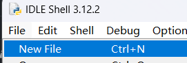

然后即可编写python代码

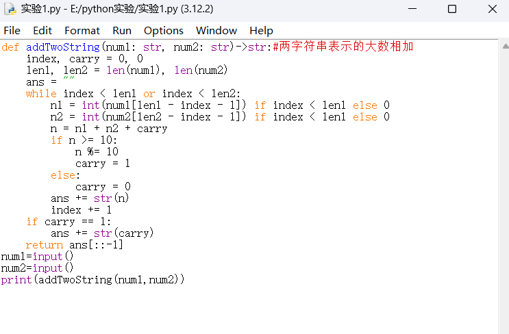

点击Run-Run Module 即可运行代码

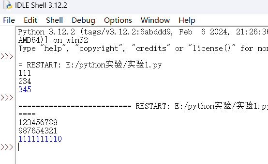


```python
def addTwoString(num1: str, num2: str)->str:#两字符串表示的大数相加(虽然python做这个有种用叉子吃饭的感觉)
    index, carry = 0, 0
    len1, len2 = len(num1), len(num2)
    ans = ""
    while index < len1 or index < len2:
        n1 = int(num1[len1 - index - 1]) if index < len1 else 0
        n2 = int(num2[len2 - index - 1]) if index < len1 else 0
        n = n1 + n2 + carry
        if n >= 10:
            n %= 10
            carry = 1
        else:
            carry = 0
        ans += str(n)
        index += 1
    if carry == 1:
        ans += str(carry)
    return ans[::-1]
num1=input("请输入一个大整数: ")
num2=input("请输入第二个大整数: ")
print("相加结果为:", addTwoString(num1,num2))

```

    请输入一个大整数:  123456789
    请输入第二个大整数:  987654321


    相加结果为: 1111111110


4. 基于Jupyter Lab和PyCharm体验Python的交互式和脚本式编程。

(1)Jupyter Lab:在cmd中输入Jupyter Lab即可在本地主机端口运行Jupyter Lab,打开浏览器访问http://localhost:8889/lab即可到达Jupyter Lab页面,在左上角点击File-New File可以新建文件,有python文件,markdown文件等

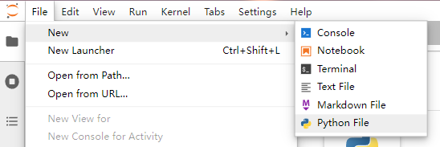

新建python后可以编写python代码

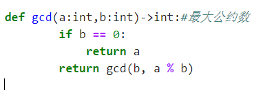

可以新建一个NoteBook将刚编写的函数导入运行

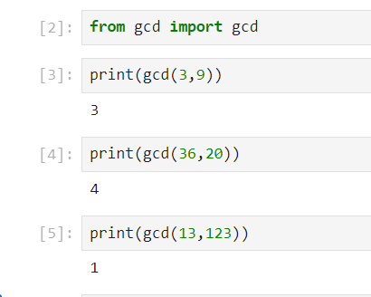


```python
def gcd(a: int, b: int) -> int:  # 最大公约数
    if b == 0:
        return a
    return gcd(b, a % b)
```

(2)PyCharm: 打开安装好的PyCharm,创建项目后鼠标右击项目目录,在"新建"选项中可以新建文件

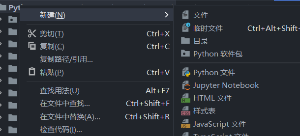

编写好代码后可以鼠标右键窗口,然后点击运行,即可运行代码


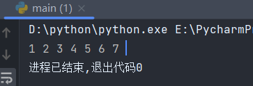


```python
class TreeNode:
    def __init__(self, val, left=None, right=None):
        self.left = left
        self.val = val
        self.right = right


def inOrder(node: TreeNode) -> None:  # 中序遍历树
    if node is None:
        return
    inOrder(node.left)
    print(node.val, end=" ")
    inOrder(node.right)


"""
     4
   /    \
  2      6
 / \    / \
1   3  5   7
"""
root = TreeNode(4,
                TreeNode(2, TreeNode(1), TreeNode(3)),
                TreeNode(6, TreeNode(5), TreeNode(7))
                )
inOrder(root)
```

    1 2 3 4 5 6 7 

### 四、实验总结

​	在这节实验课上, 我学习了如何下载安装Python SDK与Anaconda开发包, 并且进行正确地配置, 以得以在电脑上编写和运行python代码
​	然后我在Python SDK的IDLE中使用交互式编程以及脚本式编程编写了一些简单的代码, 体会了python的语法结构, 学习了python语言的工作方式
​	随后我了解到了更高效的Python开发工具Jupyter Lab和PyCharm,我通过官网教程对其进行了下载和安装
​	最后我打开Jupyter Lab和PyCharm再次编写并成功运行了一些python代码
​	通过本次实验课, 我对python语言程序设计有了初步的了解, 熟悉了python语言的编写方式, 在Jupyter Lab和PyCharm等集成开发环境下, 我对python的学习将事半功倍.
